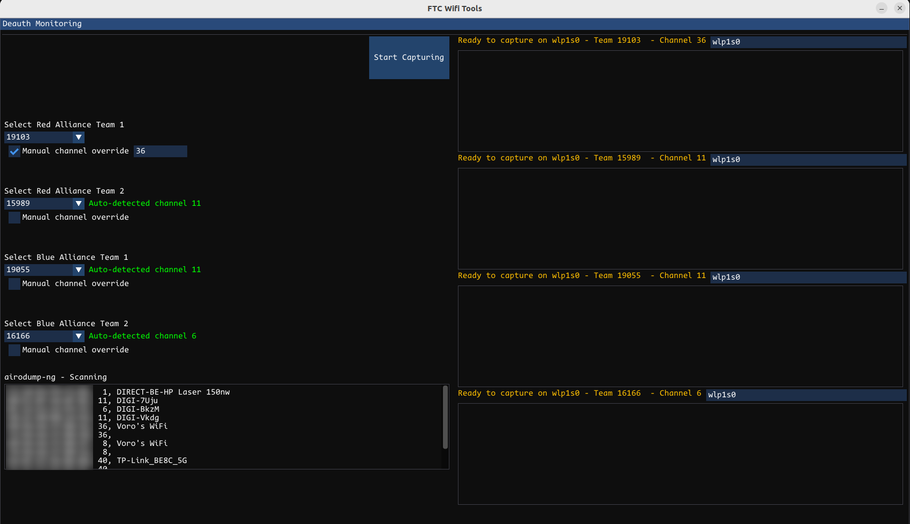

# FTC Wifi Tools

A very simple Python program made to simplify the monitoring of deauth packets during FTC events.

## Features (WIP)
- Filters for per-channel deauth packets 
- Automatic channel detection for each of the four teams playing a match
- Supports up to four wifi interfaces
- Supports event schedule to switch between matches very quickly (not yet)
- Saves all captures to disk for inspection later (not yet)

## Dependencies
- Dear Imgui Python bindings with pygame backend
- tshark for packet sniffing
- airodump-ng for access point scanning

## Disclaimer
This small program is just to simplify the job of monitoring FTC matches. It does not scale at all, it's very tightly coupled and poorly written. Use at your own risk.